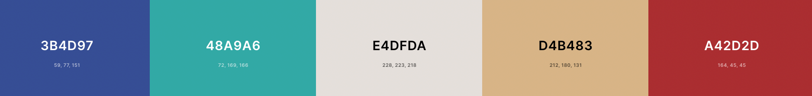

# Project 2 - Insured

[Insured live demo](https://jannis-kiriasis.github.io/insured/index.html)\
[Insured repository](https://github.com/jannis-kiriasis/insured)

## Table of contents
-   [Introduction](#introduction)
-	[User Experience (UX)](#user-experience-ux---user-stories)
-	[Features](#features)
-	[Where user stories meet features](#where-user-stories-meet-features)
-	[Wireframes](#wireframes)
-   [Features left to implement](#features-left-to-implement)
-	[Designs](#design)
-   [Accessibility](#accessibility)
-   [SEO](#seo)
-	[Technologies and tools used](#technologies-and-tools-used)
-	[Testing](#testing)
-	[Issues fixed](#issues-fixed)
-	[Deployment](#deployment)
-	[Credits](#credits)
-   [Acknowledgements](#acknowledgements)

## Introduction

Insured let you quickly and painlessly apply for a life insurance cover.

Have you ever thought about getting a life insurance cover for you and you family?

You may have, but many people don't think about it until they need it. It usully is too late to get one at that stage.

Insured was born to answer people most basic question: "Do I need life insurance?".

A quick search with Google Keywords Planner can reveal how many questions people have about life insurance that need to be answered before to get one.

All those questions can be resumes in 3 main queries:
- Do I need life insurnace?
- What Life insurance do I need?
- How much life insurance do I need?

This is exaclty what Insured do:
1. Let you know if you need a life insurance
2. Help you undertand what type of life cover you need
3. Let you apply for a cover painlessly

### Who is Insured for?
Insured is for those people who aren't sure whether they should get a life cover and those who need some clarity around the cover types available.

### What Insured offer:
- A quick questionnaire to understand users life insurance needs.
- A simple life cover calculator to find out how much cover users need.
- An almost totally prefilled application form that let you apply for a life policy only and painlessly.

## User Experience (UX) - user stories
Now that we are familiar with Insured target audience and offering, we are looking at the needs website visitors may have. Following, you can find the users' stories covering the main users' needs.

### Visitor goals
- As a first-time visitor, I want to easily understand the main purpose of the site
- As a first-time visitor, I want to have a better Idea of what cover I need
- As a first-time visitor, I want to get a better understanding of what I need to consider when deciding on a life policy
- As a first-time visitor, I want to see how long the questionnaire takes to complete
- As a user, I want to see at what stage of the questionnaire I am and the number of questions left
- As a user, I want to get a personalised result based on my personal needs
- As a user, I want to be able to take the questionnaire again
- as a user, I want to be able to find out how much cover I need
- As a user, I want to be able to apply for a cover easily

## Features

In the following paragraphs, we are going to see what features appear on the website and where they meet the users' needs.

### Global features

This is a list of features that appear on every page.

1.	**Logo and navigation**  
    The logo appears on every page. As an industry standard, the logo links back to the homepage.

    

2.	**Main heading**  
    A main heading appears on every page of the questionnaire, calculator and application form.
    In the questionnaire, the main heading is the placeholder for the questions. Its content changes using DOM manipulation rules at every button click.

    

3.	**Navigation / stages**  
    I've used graphics to represent the 3 steps included in the website: The questionnaire, the calculator and the application form. The current page icon becomes Verdigris when the page is active.

    While this can be used as navigation, it is reccommanded to follow the on screen instructions for the best experience instead of jumping from a page to the other by clicking on the icons. 

    

### Questionnaire features - index.html

4.	**Progress bar**  
    The progress bar helps users to see at what stage of the questionnaire they are. There is an intro, 5 questions and the results page. 
    The current progress circle is blue. The past quetions / pages are green. The progress bar updates at every button click, so when users start the quetionnaire or answer a question.

    

    **Mobile progress bar**  
    The mobile progress bar shows the current page only when users are on the intro page or results page. On the actual questions, the progress update shows the current question number on the total (x / 5).

    

5.	**Intro page**  
    The intro page explain to users what Insured is all about. It also collects the user name which is stored in session storage and used later on. The user name is required and it's validated with other JS rules. 

    If users clicks on 'start' and the user name hasn't been added or it doesn't pass validation, an alert message will show and the input fields border becomes red.

    

6.	**Question pages**  
    When users click start on the intro page and pass the username validation test, the first question is served and the progress bar updates. Yes and no buttons also appear on the screen. This is all handled with DOM manipulation and updated as the user clicks on yes / no to go to the next question.

    User answers are stored in variables.

    

7.	**Results page**  
    Based on the answers provided, the results page tells users what life cover they may need. It uses logic to determine what content to show. If users answers yes to at least 1 question, the 'calculate your life insurance need' button is shown. It brings users to the next step: calculate the cover amount they need. If all the users answers have a negative outcome, only the button to restart is shown.

    

### Life cover calculator features - life-insurance-calculator.html

8.	**Calculator**  
    A simple calculator to help users figure out how much life insurance they need. There are only 2 input fields: salary and years of cover needed. The calculation is a simple moltiplication. input fields are validated with HTML and JS rules.

    If the input fields aren't blank and differ from 0, an 'apply now for this cover' button is shown together with a 'recalculate' button.

    Users inputs are saved in session storage.

    

### Application form features - application-form.html

9.	**Application form**  
    The contact form is prepopulated with the data previously asked to users. Users only need to add their contact details and click apply. New input fields validation rules are used on all fields. 

    

10. **Confirmation message**
    An application submitted message appears on the screen when the form is submitted correctly. This is done using DOM manipulation. In the confirmation message there is also a summary of the information submitted and a button to restart from the questionnaire.

### Others
11. **Custom 404 page**  
    A custom 404 page asks visitors what page they were looking for.

    

## Where user stories meet features

In the following paragraph, I’m going to match features with user needs (user stories). The features are numbered and the same feature numbers appear in the table below.

| **User stories**                                                                                                        | **Features** |
|-------------------------------------------------------------------------------------------------------------------------|--------------|
| As a first-time visitor, I want to easily understand the main purpose of the site                                       | 2, 3, 6         |
| As a first-time visitor, I want to have a better Idea of what cover I need                                              | 7            |
| As a first-time visitor, I want to get a better understanding of what I need to consider when deciding on a life policy | 7, 8         |
| As a first-time visitor, I want to see how long the questionnaire takes to complete                                     | 4            |
| As a user, I want to see at what stage of the questionnaire I am and the number of questions left                       | 4            |
| As a user, I want to get a personalised result based on my personal needs                                               | 7            |
| As a user, I want to be able to take the questionnaire again                                                            | 8            |
| As a user, I want to be able to find out how much cover I need                                                          | 8            |
| As a user, I want to be able to apply for a cover easily                                                                | 9            |

## Wireframes

The first draft of the website was completed by creating wireframes using Balsamic. 

- **Questionnaire**   

- **Calculator & Application form**  
I had the idea of adding a calculator and an application form while WIP so wireframes aren't available.

## Features left to implement 

- Little info boxes can be added next to each input field to clarify why that information is needed.
- Additional fields can be added to the calculator to make it more advanced. An 'extra fields' dropdown could reveal more input fields and so give users the option to use the short calculator or the advanced calculator.
- More questions can be added to the questionnaire: there are life insurance policies that haven't been covered such us the serious illness cover. More questions can be asked to the users to give an even more specific result.
- Calculators for mortgage protection and income protection can also be created.
- Preselected cover type input fields can be added to the application form. The field will be preselected to the cover type users need based on their questionnaire results.

## Design

In the following paragraph, I'm going to explain the colours, typography and imagery choices.

### Colours

The main color used is a shade of blue (liberty). Blue is a calm and serene color. It is often associated to stabilitty and reliability. Most of the insurance companies I can think of have at least one shade of blue in their color palette (Allianz, Aviva, Axa, Zurich to name a few) and so Insured had to have a blue too. 

As I chose Liberty, I needed an opposite colour to create contrast with important elements on the page, such as the buttons. So, I picked a shade of red, Fuzzy Wuzzy and adjusted it to increase its contrast ratio on with foreground (to pass accessibility tests). 

As secondary colours, I've used a shade of green (Verdigris) to highlight the past questions in the progress bar, and a tan color used for smaller decorative purpuses. I've also added  Timberwolf in case I needed a lightgrey but I haven't used it. May become useful for future development. 

All the text color combinations have been tested for accessibility and they all achieve a minimum of WCAG AA.
- [Colour contrast test: white on red](./README-files/red-white.png) - Used on buttons.  
- [Colour contrast test: black on lightblue](./README-files/black-lightblue.png) - Used on main text area.  
- [Colour contrast test: blue on lightblue](./README-files/blue-lightblue.png) - Used on headings.  

Tested with [Contrast checker](https://color-contrast-checker.deque.com/)

### Typography

The typography was chosen for my liking. Open Sans is a very popular font if not the most popular.

I used [Open Sans](https://fonts.google.com/specimen/Open+Sans) for all body elements.  

The fallback font used is Helvetiva for all body elements.

### Imagery

I've used graphics for the logo, favicon the the navigation process. All the illustrations come from [Freepik](https://www.freepik.com/home).

I've used svg images where possible which are lighter than jpg and since it's a vector format, graphics always loook sharp. It works well with logos and 'flat' graphics. I've used webp format for the favicon. Nowadays, [Wepb is supported by all the major browsers](https://developers.google.com/speed/webp/faq), with [Safari being the last main browser that started supporting webp in 2020](https://caniuse.com/webp) with the release of Safari 14.

## Accessibility

As mentioned above, all the font colours passed a contrast test. During the testing phase, the white fonts on the red backgrounds (only used to style buttons) resulted low in contrast ratio. The red color was adjusted to pass and achive an accessibility score of WCAG AAA.

I've also used alt tags to describe images and aria labels to describe links and images used as background images.  
The pages have been structured using semantic HTML markup.  

The Lighthouse accessibiliy test also reports an accessibility score of 100/100. 

A Lighthouse report is available a few paragraphs below in the testing section.

## SEO

Keywords have been used in the headings of the questionnaire start page and life insurance calculator page. Each page addresses a specific search intent:
- The questionnaire page, the need of a life insurance cover
- the calculator page, the need of a cover amount calculator
- The application form, the need of getting a cover painlessly

The title tags also include target keywords and the length displays in full on Google Search. Tested with this [title tag length checker](https://www.highervisibility.com/seo/tools/serp-snippet-optimizer/).

I've included the most common metadata (description, keywords, index) and a self-referring `rel=canonical` link on each page.

I've included Open Graph tags to control the page appearence when shared on social media as posts.

The Lighthouse SEO test also reports an score of 100/100. 

A Lighthouse report is available a few paragraphs below in the testing section.

## Technologies and tools used

- [HTML5](https://en.wikipedia.org/wiki/HTML5)
- [CSS3](https://en.wikipedia.org/wiki/CSS)
- [JavaScript](https://it.wikipedia.org/wiki/JavaScript)
- Version control: [Git](https://git-scm.com/)
- Public repository: [GitHub](https://github.com/)
- Resize and edit images: [Pixlr.com](https://pixlr.com/)
- Transform png to SVG: [Convertio.co](https://convertio.co/it/png-svg/)
- Illustrations: [Freepik](https://www.freepik.com)
- Google Font: [Open Sans](https://fonts.google.com/specimen/Open+Sans)
- Wireframes: [Balsamiq](https://balsamiq.com/)
- Lighthouse: [Lighthouse](https://developer.chrome.com/docs/lighthouse/overview/)
- Colors contrast checker: [Contrast checker](https://color-contrast-checker.deque.com/)
- Colors accessibility: [Webiam](https://webaim.org/resources/contrastchecker/)

## Testing

I've carried out the following tests:

1. [HTML validation](#html-validation)
2. [CSS validation](#css-validation)
3. [Functionality testing](#functionality-testing)
4. [Browsers compatibility](#browser-compatibility)
5. [Responsiveness testing](#responsiveness-testing)
6. [Lighthouse testing](#lighthouse-testing)
7. [User stories testing](#user-stories-testing)

### HTML validation

All the pages passed the HTML validation with no errors or warnings.
- [index.html](https://validator.w3.org/nu/?doc=https%3A%2F%2Fjannis-kiriasis.github.io%2Finsured%2Findex.html)  

- [life-insurance-calculator.html](https://validator.w3.org/nu/?doc=https%3A%2F%2Fjannis-kiriasis.github.io%2Finsured%2Flife-insurance-calculator.html)  

- [application-form.html](hhttps://validator.w3.org/nu/?doc=https%3A%2F%2Fjannis-kiriasis.github.io%2Finsured%2Fapplication-form.html)  

### CSS validation

Style.css passed the CSS validation with no errors.
- [css validation](https://jigsaw.w3.org/css-validator/validator?uri=https%3A%2F%2Fjannis-kiriasis.github.io%2Finsured%2Findex.html&profile=css3svg&usermedium=all&warning=1&vextwarning=&lang=en)  

There are only 2 warnings related to `-webkit-appearance: none;` and `-moz-appearance: none;` used to style the form submit button. This was used to prevent iPhone / iPad default style. The submit button would otherwise not be styled as declared in the CSS without the webkit extension.

### Functionality testing

I've tested that the different aspects of the website work as intended.

|     Test Label                       |     Test Action                                                                                         |     Expected Outcome                                                              |     Test Outcome      |
|--------------------------------------|---------------------------------------------------------------------------------------------------------|-----------------------------------------------------------------------------------|-----------------------|
|     Header and   navigation links    |     Click on all header   internal links to verify they work (all pages).                               |     No links return a   404 error.                                                |     PASS all pages    |
|     Header and   navigation links    |     Click on all header   internal links to verify they link to the right pages (all pages).            |     All links should   link to the pages described in their anchor texts.         |     PASS all pages    |
|     Internal links                   |     Clink on   index.html and services.html internal links to verify they work.                         |     No links return a   404 error.                                                |     PASS all pages    |
|     Internal links                   |     Clink on   index.html and services.html internal links to verify they link to the right   pages.    |     All links should   link to the pages described in their anchor texts.         |     PASS all pages    |
|     External links                   |     Click on all   external links and verify that they work (footer links).                                  |     No links return a   404 error.                                                |     PASS all pages    |
|     External links                   |     Click on all   external links and verify that they open in a new tab (footer links).                |     All external   links open in a new tab.                                       |     PASS all pages    |
|     Form completion                  |     Complete a form   and verify all fields are set to required.                                        |     The form won’t submit   if a field is missing.                                    |     PASS              |
|     Form validation                  |     Complete a form   and verify the correct field types are used (eg. Email)                           |     The form won’t submit   if the fields aren’t correctly completed.                 |     PASS              |
|     Form submission                  |     Check that form submission   input names are appropriate and all fields are submitted.                   |     The input names submitted   are descriptive and no field can be left blank.    |     PASS              |
|     Interactivity                    |     Check that   navigation and internal links visually change on mouse hover.                          |     Links and buttons   change colour on mouse hover.                              |     PASS              |
|     Navigation                       |     Check that the current   page is identifiable in the navigation.                                    |     The currently   active page link is orange in navigation.                     |     PASS              |
|     404 links                       |     Click on a non existing URL and verify it lands on the custom 404 page.                                    |      A non existing page links to the custom 404.html                    |     PASS              |

### Browser compatibility

All the functionality tests have been carried out and achieved a PASS on the latest versions of the following browsers:
- Google Chrome
- Safari
- Firefox
- Microsoft Edge

### Responsiveness testing

All the functionality tests have been carried out and achieved a PASS on the following screen resolutions:
- 365x667 (iPhone SE)
- 540x720 (Surface Duo)
- 1280x800 (Nest Hub Max)
- 2560x1600 (Macbook Pro M1)

The website has also been tested for responsiveness on [ami.responsivedesign.is](http://ami.responsivedesign.is/) with the following results:
- [index.html](http://ami.responsivedesign.is/?url=https://jannis-kiriasis.github.io/digibooking/index.html)
- [services.html](http://ami.responsivedesign.is/?url=https://jannis-kiriasis.github.io/digibooking/services.html)
- [contact.html](http://ami.responsivedesign.is/?url=https://jannis-kiriasis.github.io/digibooking/contact.html)

### Lighthouse testing
Overall, the lighthouse report is very positive. 

  
[Lighthouse report](https://googlechrome.github.io/lighthouse/viewer/?psiurl=https%3A%2F%2Fjannis-kiriasis.github.io%2Fdigibooking%2Findex.html&strategy=mobile&category=performance&category=accessibility&category=best-practices&category=seo&category=pwa&utm_source=lh-chrome-ext)

Performance on mobile devices can be further optimised by reducing the Largest Contentful Paint and the First Contentful Paint.

- The FCP can be optimised by reducing the number of Critical Request Chains: Not using Fontawesome and Google Fonts is a solution to further improve the performance score.

- The LCP can be optimised by using a CDN to serve images (the hero images are the LCP, the largest element loading above the fold) or by removing the hero images from mobile hero banners.

Note that the performance score varies also depending on the internet connection and device used for testing.

### User stories testing

I've tested whether the user needs have been satisfied with the features created.

|     User stories                                                                                                                     |     Features                            | Result   |
|--------------------------------------------------------------------------------------------------------------------------------------|-----------------------------------------|----------|
|     As a first-time visitor, I want to easily understand the main purpose of the site                                                | 4, 6                                |     PASS |
|     As a first-time visitor, I want to be able to navigate the website easily                                                        | 1, plus   various internal links    |     PASS |
|     As a first-time visitor, I want to understand what services Digibooking offer                                                | 6, 7, 8, 9, 10                      |     PASS |
|     As a first-time visitor, I want to get an idea of how trusted the website (agency) is                                            | 5                                   |     PASS |
|     As a returning visitor, I want to get in touch with Digibooking and find out the best way to contact                             | 3, 11                               |     PASS |
|     As a returning visitor, I want to know when the best time is to get in touch with Digibooking customer service or sales teams    | 3                                      |     PASS |
|     As a frequent visitor, I want to find the agency address in case of an on-site meeting                                           | 3                                       |     PASS |

## Issues fixed

1. Fit 2 columns with width 50% and margin on the same row. The total width + margin is above 100%. Solution: use padding instead of margin and `box-sizing:border-box;`. The padding width is included in the column width. [Stackoverflow](https://stackoverflow.com/questions/14416651/including-margin-for-width-and-height).
2. Make the button left and right sides completely rounded. Setting a `border-radius: 50%` will make my button completely rounder. Solution: Set the `border-radius` to the same dimension as the left and right padding.
3. Center align horizontally 4 images in a div. Solution: used `display: flex;` and `justify-content: center;`. [Stackoverflow](https://stackoverflow.com/questions/10989238/.center-image-horizontally-within-a-div).
4. Make `search-services-white` and `search-services-light-blue` divs grow with their content. Solution: Add `overflow:hidden` to the parent container. [Stackoverflow](https://stackoverflow.com/questions/4657148/how-to-make-a-div-grow-with-content).
5. Override iPhone / iPad default styling of submit button. The button isn't styled as declared in the CSS. Solution: add to the class .button `-webkit-appearance: none;`. [Stackoverflow](https://stackoverflow.com/questions/5438567/css-submit-button-weird-rendering-on-ipad-iphone).
6. Prevent telephone link in footer default styling on iPhone / iPad. Solution: declare the styling of the <a> tag. [Stackoverflow](https://stackoverflow.com/questions/3736807/how-do-i-remove-the-blue-styling-of-telephone-numbers-on-iphone-ios).

## Deployment

I've deployed the website on GitHub Pages. The website was developed on Gitpod and pushed to its GitHub repository using git command lines in the terminal. Every time a commit pushed to the website's repository updates the HTML and CSS files, GitHub Pages automatically updates the live demo.
To deploy the website:
1. from the GitHub repository, click on 'settings'
2. find and click on 'pages' on the setting sidebar menu
3. select the branch to be used. In this case 'main'
4. Refresh the page and in a few minutes, the following message will appear if the website was deployed correctly

To run the website locally, use your preferred text editor and paste `git clone https://github.com/jannis-kiriasis/digibooking.git` into your terminal. To find more cloning options click on the 'code' dropdown in the [digibooking repository](https://github.com/jannis-kiriasis/digibooking/).

## Credits

### Hotel booking illustration attributions

- [Hotel booking vector created by vectorjuice - www.freepik.com](https://www.freepik.com/vectors/hotel-booking)  
- [Helpline vector created by vectorjuice - www.freepik.com](https://www.freepik.com/vectors/helpline)  
- [Hotel booking vector created by vectorjuice - www.freepik.com](https://www.freepik.com/vectors/hotel-booking)  
- [Cartoon city vector created by vectorjuice - www.freepik.com](https://www.freepik.com/vectors/cartoon-city)  
- [Mobile map vector created by vectorjuice - www.freepik.com](https://www.freepik.com/vectors/mobile-map)  

### Clients logos 

- [rawpixels.com](https://www.rawpixels.com)

### Digital icons 

- [Keyword icons created by Smashicons - Flaticon](https://www.flaticon.com/free-icons/keyword)  
- [Money icons created by itim2101 - Flaticon](https://www.flaticon.com/free-icons/money)  
- [Booking icons created by Icongeek26 - Flaticon](https://www.flaticon.com/free-icons/booking)  

## Acknowledgements

I previously worked in a digital marketing agency having as a client a big hotel chain. I've also helped my family business, a short term lettings business, grow online using SEO, PPC and Google Hotel Ads. Hence I came up with this website. I'm also an SEO specialist and I have been building and working on websites using Content Management Systems for the past 6 years.

Brian Macharia, my mentor, helped me test the website functionalities and provide excellent recommendations.

The first 3 input fields of the [contact form](contact.html) were taken from the Love Running project and edited to fit this website. There isn't a link since it was a challenge I have completed but I believe this is the [sign up form](https://github.com/Code-Institute-Solutions/love-running-lab-solutions/blob/master/signup.html). 

The social links code in the footer also comes from the [Love Running social icons](https://github.com/Code-Institute-Solutions/Love-Running-Solutions/blob/master/06_site_footer/01_footer_main_structure/index.html) and they have been edited as needed.